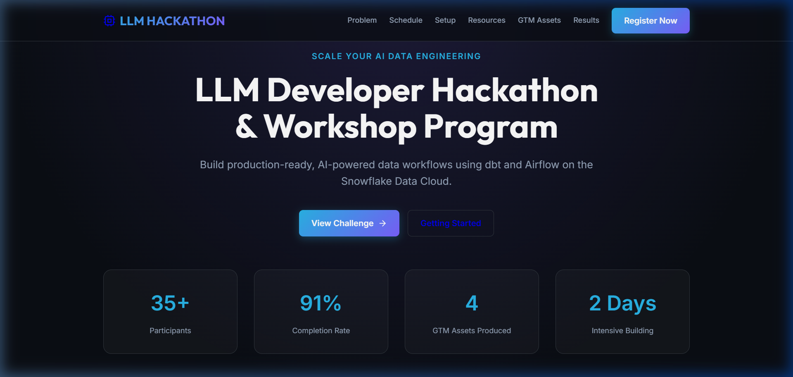
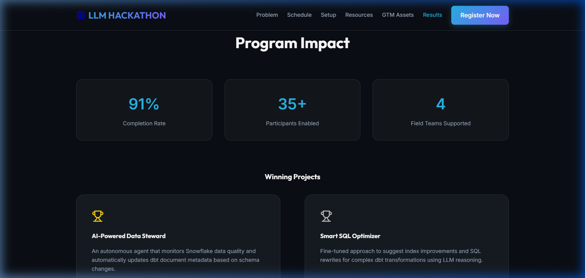

# LLM Developer Hackathon & Workshop Portal

A professional, enterprise-grade developer event website designed for a 2-day intensive hackathon focused on building AI-powered data workflows with **dbt**, **Airflow**, and **Snowflake**.



## 🚀 Live Site
Check out the production deployment here: **[Live Link](https://asheth2310.github.io/Hackathon-Workshop-Program/)**

---

## 🛠️ Tech Stack
- **Framework**: [React 18](https://react.dev/) + [Vite](https://vitejs.dev/)
- **Navigation**: [React Router 6](https://reactrouter.com/) (HashRouter for GH Pages compatibility)
- **Icons**: [Lucide React](https://lucide.dev/)
- **Styling**: Vanilla CSS with a Snowflake-inspired design system
- **Deployment**: GitHub Pages

---

## ✨ Features
- **Comprehensive Program Guide**: 7 dedicated pages covering the entire event lifecycle.
- **Interactive Resources**: RAG patterns, Function Calling schemas, and dbt/Airflow integration tutorials.
- **Enterprise Design**: Dark-themed, glassmorphic UI with Snowflake/AI branding.
- **GTM Assets Portfolio**: UI for downloading solution briefs, demo scripts, and playbooks.
- **Impact Dashboard**: Real-time stats showing participant engagement and winning projects.

---

## 📊 Event Results

- **91% Completion Rate** across all field teams.
- **35+ Participants** successfully enabled on Snowflake-AI workflows.
- **4 Strategic GTM Assets** produced for field enablement.

---

## 💻 Project Setup & Workflow

### 1. Installation
Clone the repository and install dependencies:
```bash
git clone https://github.com/asheth2310/Hackathon-Workshop-Program.git
cd Hackathon-Workshop-Program
npm install
```

### 2. Development Workflow
Start the local development server:
```bash
npm run dev
```
The site will be available at `http://localhost:5173/` (or `5174` if the port is in use).

### 3. Deployment Workflow
This project uses `gh-pages` for automated deployment. To push updates to the live site:
```bash
npm run deploy
```
This will build the project and push the `dist/` folder to the `gh-pages` branch.

---

## 📂 Project Structure
- `src/App.jsx`: Main application logic and routing for all 7 sections.
- `src/index.css`: Global design system with HSL tokens and terminal/timeline styles.
- `demo/`: High-resolution screenshots for documentation.
- `vite.config.js`: Configured with relative base paths for robust sub-folder hosting.

---

## 🏆 Program Goals
The primary objective of this portal is to move developers from "prompt engineering" to "AI Data Architecture," enabling them to build scalable, AI-driven data pipelines that provide real business impact.
